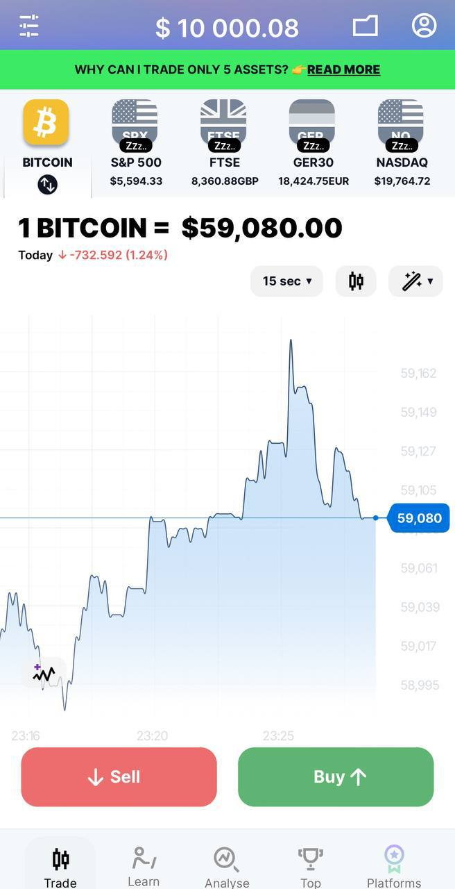

# Экран 2 — График и сделки

Экран имитирует бинарные опционы с выбором направления и времени сделки.

## Функции
- Линейный график цен с переключаемыми таймфреймами.
- Выбор актива из горизонтального списка.
- Открытие сделки `Buy ↑` или `Sell ↓` на 1 или 5 минут.
- Таймер отслеживает время до закрытия сделки.
- Результат сделки влияет на [баланс](components.md#данные-и-хранилища).
- Данные по активу поступают из [API котировок](api.md#quotes).

Навигация через нижнюю панель (см. [Компоненты](components.md#навигация)).
